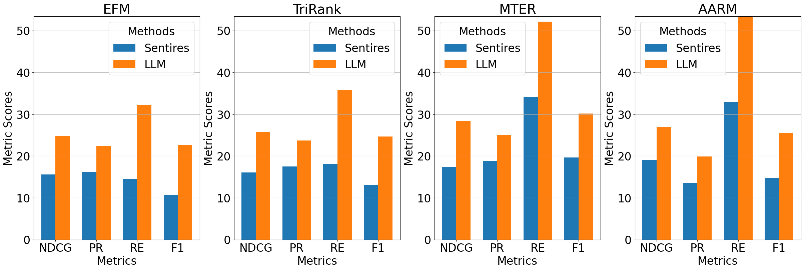

<h1 align="center"> Improving Tourism Accessibility with Data Analytics </h1>

## Project Overview

We're developing a travel accessibility profiling system that aims to enhance tourism services for people with disabilities. By analyzing social media data and online reviews, we're identifying key accessibility attributes and sentiments across different disability groups. Our goal is to create accessibility-aware location recommendations using advanced data science techniques, including natural language processing and sentiment analysis. This project not only contributes to more inclusive tourism but also provides valuable hands-on experience in cutting-edge data analytics and research methodologies

## Contents
- [Project Overview](#project-overview)
- [Contents](#contents)
- [Data Collection](#data-collection)
- [Data Processing](#data-processing)
- [Quadruple Extraction](#quadruple-extraction)
  - [Sentires Integration](#sentires-integration)
  - [LLM-based Extraction](#LLM-based-extraction)
- [Recommendation Systems for Users with Disabilities](#recommendation-systems-for-users-with-disabilities)
- [Interpretability of the Recommendation System](#interpretability-of-the-recommendation-system)

## Data Collection
The data collection process is implemented through a specialized web crawler located in the `./web_crawler/` directory. This crawler is designed to extract hotel reviews from [TripAdvisor](https://www.tripadvisor.com/), focusing on accessibility-related information across Australia.

To run the crawler:

```
cd ./web_crawler/
python scraper.py
```

The crawler architecture is illustrated in `./img/crawler.png`.

Our dataset encompasses:
- 880,571 reviews
- 627,810 unique users
- 2,013 hotels

This extensive dataset provides valuable insights into the accessibility perceptions of various disability groups regarding tourism services.

## Data Processing
The data processing module, located in `./data_filtering/`, is responsible for extracting disability-related reviews from a large corpus of general business reviews. This critical step ensures the dataset's relevance to accessibility research.

Key features:

1. Keyword-based Filtering: Implements a robust algorithm to identify reviews containing disability-related terms and phrases.

2. One-class SVM Model: Utilizes machine learning to detect subtle patterns indicative of disability-related content, even in the absence of explicit keywords.

This module effectively addresses the challenges of  identifying nuanced disability-related content, providing a solid foundation for subsequent analysis.

## Quadruple Extraction

The Quadruple Extraction module implements advanced sentiment analysis techniques to extract structured information from unstructured text. It generates quadruples in the format (feature, opinion, sentence, score), enabling detailed analysis of user reviews.

### Sentires Integration

We incorporate [Sentires](https://github.com/evison/Sentires), a toolkit for phrase-level sentiment analysis, to perform quadruple extraction. Sentires employs a six-step lexicon-building process, including preprocessing, POS tagging, feature-opinion pair extraction, and sentiment scoring.

```
Quadruple = Extract(Feature, Opinion, Sentence, Sentiment)
```

### LLM-based Extraction

To enhance precision, especially for disability-related hotel reviews, we leverage Large Language Models (LLMs). Our approach uses a prompt-based methodology to instruct LLMs to extract quadruples in the desired format:

```
"Extract a list of tuples from the given hotel review, where each tuple follows the format (feature, adjective, sentence, score). The score can be either -1 for negative or 1 for positive sentiment. Please do not provide any additional information."
```

This LLM integration aims to improve the accuracy and interpretability of our sentiment analysis and recommendation system.


## Recommendation Systems for Users with Disabilities

Building on our foundation of quadruple extraction from hotel reviews, particularly those that detail the experiences of individuals with disabilities, we have developed specialized recommendation systems. These systems are designed with a keen focus on explainability to ensure that the recommendations provided are not only relevant but also comprehensible to users with disabilities. This approach signifies a significant advancement in making accessibility a priority, bridging the gap between theoretical analysis and practical application for an inclusive service experience.



Our recommendation models are crafted to cater to the unique needs of users with disabilities, emphasizing the importance of personalized and understandable recommendations. The models include:

- **EFM (Explainable Factorization Machine):** Predicts user preferences with a high degree of accuracy, providing clear insights into the reasoning behind each recommendation.
- **TriRank:** Utilizes a novel triadic relationship model (User-Item-Aspect) to generate recommendations that are deeply personalized and contextually relevant.
- **MTER (Multi-Task Explainable Recommendation):** A tensor factorization approach that enhances item recommendation with explainability at its core.
- **AARM (Attention-Based Aspect Recommendation Model):** Leverages attention mechanisms to fine-tune recommendations, ensuring that the most relevant aspects are considered.

The integration of these models into our recommendation system represents a crucial step forward in our commitment to inclusivity and accessibility in service provision. By focusing on the specific needs and experiences of users with disabilities, we aim to deliver a recommendation service that is not only effective but also respectful and understanding of the diversity of user requirements.

## Interpretability of the Recommendation System

The interpretability of recommendation systems, especially those designed for users with disabilities, is paramount. It ensures not only the delivery of personalized and relevant recommendations but also provides users with understandable and transparent explanations of why certain recommendations are made. 

Our approach to enhancing the interpretability of our recommendation system involves two innovative models: CountER and MTER. Here’s how they contribute to making our system not only more effective but also more understandable:

- **CountER (Counterfactual Explainable Recommendations):** This model operates alongside the primary recommendation engine, offering aspect-based counterfactual explanations. CountER delves into the "what-if" scenarios, providing users with insights into how different aspects influence the recommendation outcomes. This model is instrumental in demystifying the black box of complex algorithms, making the recommendation process transparent and comprehensible.

- **MTER (Multi-Task Explainable Recommendation):** MTER enhances the capabilities of CountER by employing multi-task learning and tensor decomposition methods. It analyzes features and sentiment scores in user reviews to make informed recommendations. MTER’s strength lies in its ability to dissect the multi-dimensional data from reviews, offering a nuanced understanding of user preferences and item characteristics. Compared to the more opaque models, MTER stands out by elucidating the rationale behind its recommendations, thereby adding a layer of clarity to the recommendation process.
